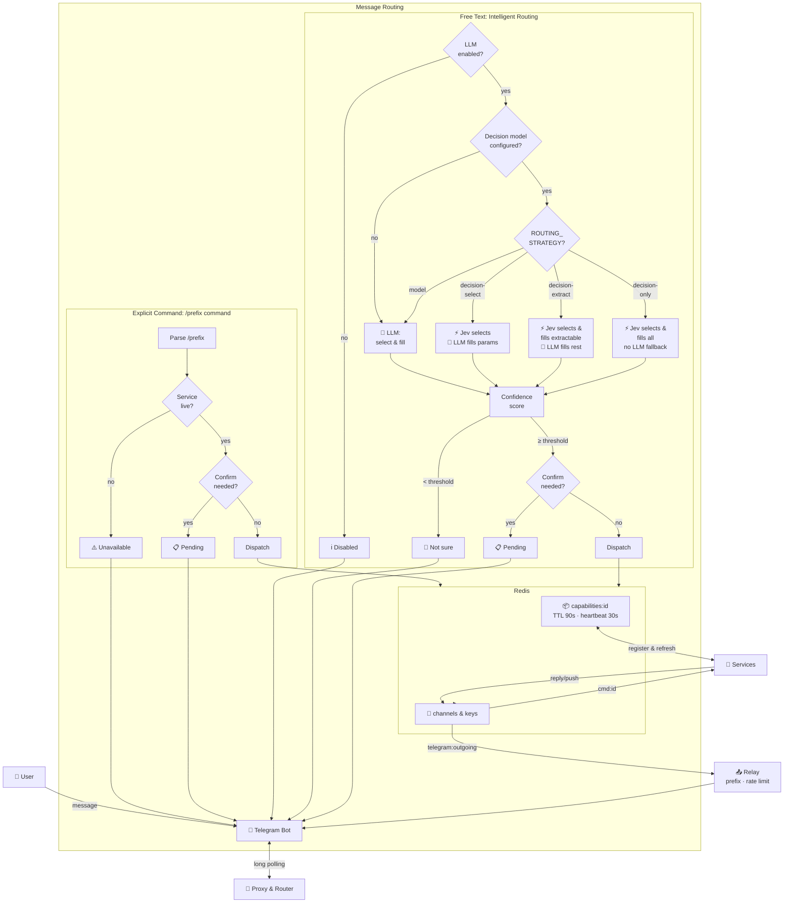
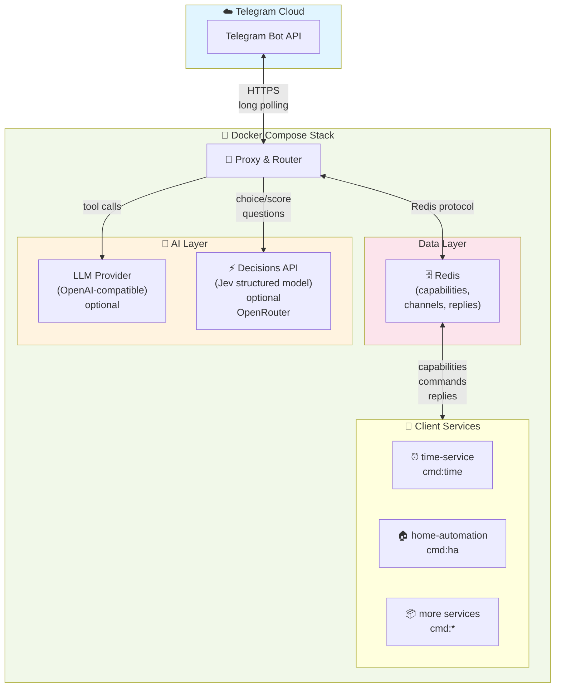
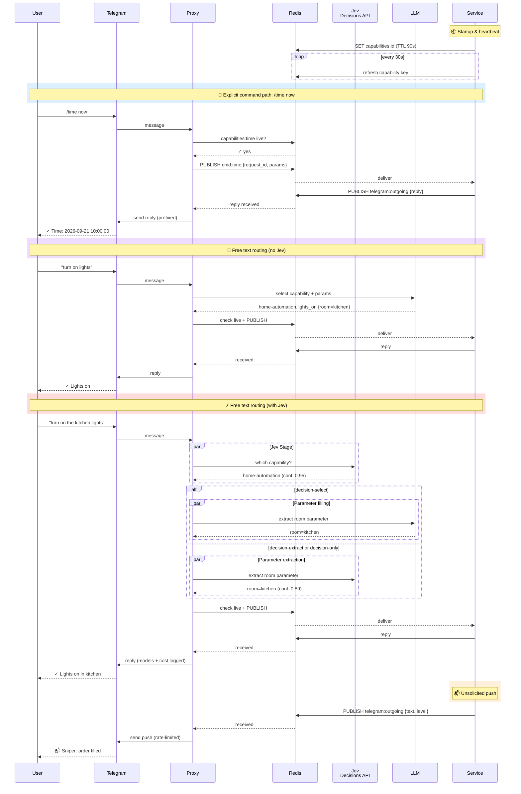

# Telegram Command Proxy

One dockerized service that holds the only connection to a Telegram bot. Client
services register their commands with the proxy instead of talking to Telegram
themselves, and a user reaches them through explicit commands or free text.

## How it works



### Topology



The proxy is the only service that talks to Telegram; every client service
reaches the user exclusively through Redis and the proxy.

### Message flow



## Quick start

Create a Telegram bot with [@BotFather](https://t.me/BotFather), run `/newbot`,
and copy the API token it returns.

```bash
cp .env.example .env
# fill in TELEGRAM_BOT_TOKEN, then start:
docker compose --profile demo up --build
```

Leave `TELEGRAM_OWNER_CHAT_ID` empty on first run. The proxy starts in
learn-owner mode and prints a one-time token in logs/stdout. Send that exact
token to your bot in Telegram; it replies with your chat id, stores it in
Redis, and becomes active immediately (no restart needed).

If your Redis data persists, this learned owner is reused on restart (no
re-pairing). Set `TELEGRAM_OWNER_CHAT_ID` in `.env` when you want to bind the
bot to an existing owner chat without learn mode, or when you need startup to
work after Redis is reset/new:

```bash
docker compose up -d proxy
```

`LLM_API_KEY` is optional in v0.1: free-text routing replies "not configured"
until an OpenAI-compatible key is provided (`LLM_BASE_URL`/`LLM_MODEL` can point
at any OpenAI-compatible endpoint).

Optionally set `STRUCTURED_DECISION_MODEL` to a structured decision model on
OpenRouter's Decisions API (e.g. `typesafe/jev-1.13`) to speed up capability
selection: the router asks that model which capability fits first, and only
calls `LLM_MODEL` afterwards to extract parameters when one is picked. A
clear non-match skips the `LLM_MODEL` call entirely. Leave it unset to route
with `LLM_MODEL` alone.

`ROUTING_STRATEGY` picks how much of the work the decision model does:

| Strategy | Selects capability | Fills parameters | Calls `LLM_MODEL` |
|---|---|---|---|
| `model` (default) | `LLM_MODEL` | `LLM_MODEL` | always |
| `decision-select` | decision model | `LLM_MODEL` | on a match |
| `decision-extract` | decision model | decision model where it can | for the rest |
| `decision-only` | decision model | decision model | never |

The three `decision-*` values require `STRUCTURED_DECISION_MODEL` and are
rejected at startup without it.

A command's parameters can be filled by the decision model only when *every*
one is declared with `enum=[...]` (it picks a canonical value) or
`extract="span"` (it picks a literal span from the message). Any command with
a parameter that needs transforming — a date to normalise, a number to parse —
falls to `LLM_MODEL`, as does any extraction reported below
`STRUCTURED_DECISION_MIN_CONFIDENCE`. Under `decision-only` there is no
fallback, so those commands reply asking for the explicit `/<prefix> <command>`
form instead.

Prefer `enum` where the value set is known: the returned value is canonical,
so a service never receives `"the Big Apple"` when it expects `"New York"`.

Set `ROUTING_VERBOSE=true` to have the bot reply to every free-text message
with the models, timings and cost it used. The same data is written to the
structured log on every routed message regardless (`models`, `cost_usd`,
`routing_seconds`), so `docker compose logs proxy` answers it without the
chat noise.

## Usage

| Message | Effect |
|---|---|
| `/help` | Router usage and list of services |
| `/help <service>` | One service's help text |
| `/capabilities` | Every registered capability in detail |
| `/configured` | Which models are configured, and which model routes each command |
| `/ha lights_on room=living room` | Explicit command (parameters as `key=value`) |
| `/time` | Runs the service's only command |
| plain text | LLM-routed free text (needs `LLM_API_KEY`) |

Help text shows complete, tappable examples like `/time now` or
`/ha lights_on room=living room`.

## Demo services

`docker compose --profile demo up` additionally runs two example clients:

- `examples/time_service.py` — `/time now`; a minimal command service.
- `examples/home_automation.py` — `/ha`; commands, parameters, and a
  confirmation-gated command (`/ha lock_door`).
- `examples/alert_pusher.py` — an output-only service that pushes alerts
  without a `request_id`.

## Client SDK

```python
import asyncio

from telegram_proxy_client import Parameter, ServiceClient

client = ServiceClient(
    redis_url="redis://redis:6379/0",
    service_id="weather",
    prefix="wx",
    display_name="Wx",
    help="Weather reports.\nCommands:\n  /wx now — current conditions",
)


@client.command(
    "now",
    description="Current weather",
    examples=["what's the weather like"],
    usage="now",
    parameters={"city": Parameter(type="string", required=True)},
)
async def now(parameters: dict[str, str]) -> str:
    return f"Weather in {parameters['city']}: sunny, 21C"


async def main() -> None:
    await client.run()


if __name__ == "__main__":
    asyncio.run(main())
```

The client registers its capabilities on Redis with a heartbeat (30s refresh,
90s TTL), listens on `cmd:<service_id>` for commands, and publishes replies to
`telegram:outgoing`. Output-only services call `await client.push(text, level=...)`
and register no commands.

## Configuration

See `.env.example` for every variable. Notable: Redis must run with
`notify-keyspace-events Ex` (the compose file already does) so expired
capabilities drop out of the router's cache.

## Redis security

Redis is protected by a single shared password. By default nothing is
enforced (dev mode); to enable authentication, set `REDIS_PASSWORD` in `.env`
and restart:

```bash
docker compose --profile demo up -d
```

With `REDIS_PASSWORD` set, every connection — proxy and client services —
must authenticate with it, and unauthenticated access (e.g. `redis-cli ping`
without a password) is rejected. The proxy embeds the password into its
connection automatically; client services pick it up from the
`REDIS_PASSWORD` environment variable passed through by the compose file.

Per-service isolation (each service limited to its own keys and channels) is
planned; for now all services share one credential.